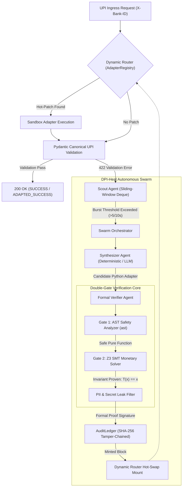

# Project DPI-Heal: Autonomous Self-Healing Middleware Swarm

> **Target Rails:** Digital Public Infrastructure (UPI / OCEN / DigiLocker)  
> **Core Innovation:** Double-Gate AST & Z3 SMT Formal Invariant Verification with Zero-Downtime Hot-Swap Dynamic Routing.

---

## 1. Architectural Overview & Problem Scope
In federated, high-throughput Digital Public Infrastructure (such as NPCI's UPI rails processing 14+ billion monthly transactions), thousands of heterogeneous participants (tier-3 rural cooperative banks, newly integrated fintech PSPs, state utility aggregators) frequently push unannounced schema mutations into production:
- Renaming `payer_vpa` to `vpa_id` or `payerVpa`
- Replacing strict numeric `amount` with formatted strings or `txn_amount`
- Nesting flat keys or transforming millisecond timestamps into ISO strings

In standard legacy gateways, these unannounced mutations trigger immediate `HTTP 422 Unprocessable Entity` or `HTTP 400 Bad Request` validation spikes, dropping transactions and causing immense consumer distress until emergency patches are manually merged hours later.

**DPI-Heal** resolves this with an autonomous, mathematically verified 3-tier agent swarm:



---

## 2. The 3-Tier Multi-Agent Swarm

### A. Scout Agent (`swarm/scout.py`)
- Real-time sliding-window telemetry analyzer using `collections.deque`.
- Calculates error velocity per upstream participant (`client_id`).
- When failures exceed the threshold (default: 5 errors in 10s), fires an `AnomalyAlert` containing sample broken payloads, error vectors, and the canonical schema delta.

### B. Synthesizer Agent (`swarm/synthesizer.py`)
- Generates pure-function translation adapters: `def adapt(payload: dict) -> dict`.
- Dual-mode architecture:
  - **LLM Synthesis**: Uses OpenAI / Claude with strict functional and safety constraints.
  - **Deterministic Semantic Fallback**: Zero-friction offline rule & AST matcher that runs out-of-the-box with zero API keys required.

### C. Formal Verifier Agent (`swarm/verifier.py`) - Novel Patent Core
Implements a strict **Double-Gate Safety Gate**:
1. **Gate 1 - AST Static Safety Isolation**:
   - Forbids all imports (`Import`, `ImportFrom`), dunder traversal (`__class__`, `__subclasses__`), global/nonlocal mutations, and dangerous built-ins (`eval`, `exec`, `open`, `os`, `socket`).
   - Forbids unbounded loops (`while`) to guarantee bounded execution (< 50ms).
2. **Gate 2 - SMT Invariant Verification (Z3 Solver)**:
   - Formulates a mathematical theorem in Z3 proving monetary conservation:  
     $$\forall x \in \mathbb{R}_{>0}, \quad T(x) = x$$
     If an adapter attempts fee skimming, truncation, or mathematical manipulation, the Z3 solver flags `SAT` (counterexample found) and halts deployment immediately.
   - Enforces strict PII stripping (`mpin`, `aadhaar`, `pin`, `cvv` are purged).
   - Verifies canonical output against Pydantic v2 `CanonicalUPIPaymentRequest`.

### D. Dynamic Router (`gateway/dynamic_router.py`) & Audit Ledger (`core/ledger.py`)
- **In-Memory Hot-Swap Dispatcher**: Mounts the compiled adapter function directly into memory without restarting the ASGI process.
- **Append-Only Cryptographic Ledger**: Mints a SHA-256 chained block containing the AST hash, proof signature, and verification summary, guaranteeing immutable non-repudiation.

---

## 3. Quickstart & Execution

### Prerequisites
- Python 3.11+
- Virtual environment (recommended)

### Install Dependencies
```bash
pip install -r requirements.txt
```

### Run the Autonomous End-to-End Simulation
Runs the complete interactive demonstration showcasing normal traffic, breaking schema drift, autonomous detection, AST & Z3 verification, hot-swap patch mounting, and traffic recovery:
```bash
python main.py --simulate
# or simply:
python main.py
```

### Launch the Live FastAPI Gateway Server
```bash
python main.py --serve --port 8000
```
Interactive Swagger API documentation will be available at:  
`http://127.0.0.1:8000/docs`

### Run the Full Test Suite
```bash
pytest -v
# or
python main.py --test
```

---

## 4. Multi-Provider LLM Integration & Autonomous Self-Repair

DPI-Heal supports **any LLM provider** out of the box with zero code changes. Copy [.env.example](file:///C:/Users/HP/.gemini/antigravity/scratch/dpi_heal/.env.example) to `.env` and set your key:

### A. OpenAI
```bash
OPENAI_API_KEY="sk-..."
LLM_MODEL="gpt-4o-mini"
```

### B. Google Gemini (Fast & Free Tier)
```bash
GEMINI_API_KEY="AIzaSy..."
LLM_MODEL="gemini-1.5-flash"
```

### C. Groq Cloud (Ultra-Fast 500+ tokens/sec)
```bash
GROQ_API_KEY="gsk_..."
LLM_MODEL="llama-3.3-70b-versatile"
```

### D. Anthropic Claude
```bash
ANTHROPIC_API_KEY="sk-ant-..."
LLM_MODEL="claude-3-5-haiku-20241022"
```

### E. 100% Local Models (Ollama / LM Studio / vLLM - Zero Cost, Zero API Keys)
```bash
LLM_PROVIDER="ollama"
LLM_BASE_URL="http://localhost:11434/v1"
LLM_MODEL="llama3.2"
```

### Autonomous Verifier Feedback Loop:
If the LLM generates an adapter that violates an invariant (e.g. attempting fee skimming or forgetting a field), the **Formal Verifier** returns the exact mathematical reason and AST violation back to the Synthesizer. The Orchestrator prompts the LLM with the verifier's feedback, enabling the agent to autonomously correct its code across multiple retry attempts before hot-swapping into production!

---

## 5. API Specification

| Method | Endpoint | Description |
|---|---|---|
| `POST` | `/api/v1/upi/pay` | UPI Payment Ingress (`X-Bank-ID` header). Dynamically routes through hot-patches. |
| `GET` | `/api/v1/metrics` | Live telemetry, active adapters, burst rates, and ledger status. |
| `GET` | `/api/v1/ledger` | Full blockchain audit trail with cryptographic integrity verification. |
| `GET` | `/api/v1/adapters` | List of currently mounted hot-swapped adapters. |
| `DELETE` | `/api/v1/adapters/{client_id}` | Revokes an active hot-patch. |
| `GET` | `/health` | Gateway health check. |

---

## 6. Security & Invariant Guarantee Matrix

| Invariant | Verification Mechanism | Failure Action |
|---|---|---|
| **No Dynamic Code Execution** | AST Node Inspection (blocks `eval`, `exec`, `import`) | Immediate Rejection |
| **Monetary Value Conservation** | Z3 SMT Solver ($\forall x > 0, T(x) = x$) | Immediate Rejection |
| **Currency Invariance** | Strict constraint check (`INR`) | Immediate Rejection |
| **PII & MPIN Protection** | Blacklist stripping & schema validation | Immediate Rejection |
| **Tamper Evidence** | SHA-256 Blockchain with proof-of-work sealing | Non-Repudiation Audit |
